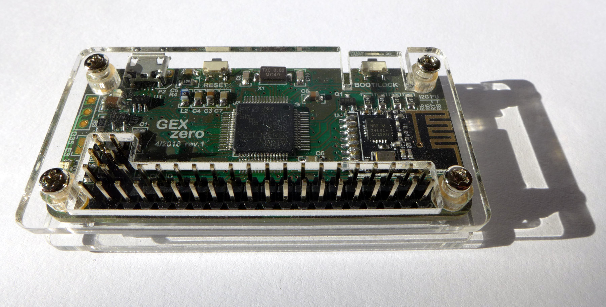
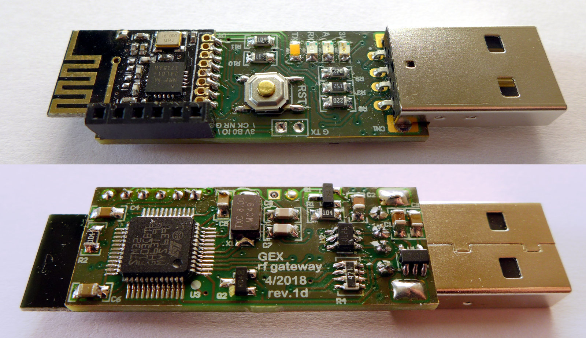
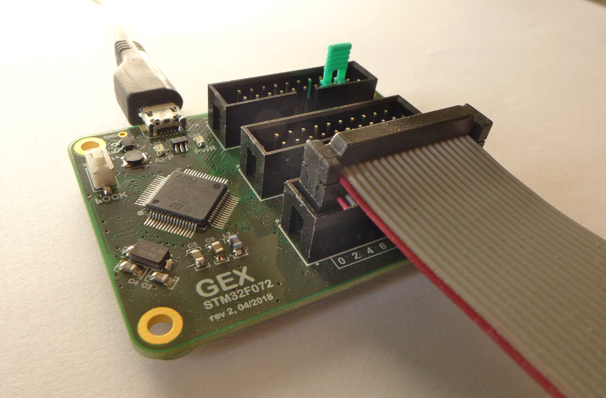

## GEX

GEX ("GPIO Expander") is a open-source software and hardware platform built for STM32 microcontrollers that brings the Raspberry Pi-like GPIO header to the PC. The header functions as a set of GPIO pins, but the microcontroller's peripoheral blocks may also be used for higher-level functions, like digital buses (SPI, I2C, or USART), analog signal acquisition, waveform generation, PWM generation and measurement, frequency measurement, and more.

GEX was developed for [MightyPork](https://www.ondrovo.com/)'s [Master's Thesis][thesis] (submitted in May, 2018) and remains in active development to support more hardware platforms and improve its functionality. 

The hardware modules developed for GEX are not currently available for sale, but I'm working on making it happen at some point. The complete Altium projects, as well as exported gerbers, are free to download and e.g. order from OSHPark.

**GEX Zero**, re-using the RPi Zero form factor to support pHATs and RPi Zero cases 

**GEX Wireless Dongle** for GEX Zero (with nRF24L01+) 

## Features

Probably everyone working with embedded electronics had, at some point, enough of writing single-purpose firmwares just to try something out. GEX is not the first and certainly not the last universal tool developed to make this easier. So, what sets it aside? 

Here are some key points:

- Python and C library (MATLAB with the Python integration)
- LibUSB or Virtual COM port access
- Hardware UART or wireless connection instead of USB
- Cross-platform support thanks to PyUSB and PySerial
- Well documented protocol (see the [thesis][thesis])
- Microsecond-accurate asynchronous event timestamps (e.g. pin change detection)
- DFU firmware upload
- Virtual FAT16 file system (mass storage) with INI config files (appears as a USB flash disk)
- FreeRTOS core
- *Wide range of supported protocols, buses and features*
  - SPI
  - I2C
  - UART, USART
  - 1-Wire
  - NeoPixel
  - Touch sensing
  - ADC with oscilloscope-like features
  - DAC with DDS waveform synthesis
  - PWM generation
  - Frequency, pulse, and duty cycle measurement
  - Pulse counting
  - Raw GPIO input, output 
  - GPIO pulse output
  - GPIO pin change events

GEX is powerful, but also large and it needs more testing before it can be declared "finished". It is currently in version 1.0.0 (as of the thesis submission), but it should be still considered beta.

The currently used hardware platform is STM32F072; STM32F103 (bluepill) was used early in the development for testing, and it will be supported again after the F072 improvements are ported. Other platforms may be added later. I also want to explore the possibility of implementing GEX on the ESP32, which would certainly be very exciting.

**GEX Hub**, with a full break-out of the available GPIOs 

## Learn more

Here are some resources:

- [Thesis download page][thesis] (with attachments)
- [Hardware](https://github.com/gexpander/gex-hardware)
- [STM32F072 firmware](https://github.com/gexpander/gex-f072)
- [Wireless dongle firmware](https://github.com/gexpander/gex-nrf-dongle)
- [Python client](https://github.com/gexpander/gex-client-py)
- [C client](https://github.com/gexpander/gex-client-c)

See [github.com/gexpander](https://github.com/gexpander) for other related repositories.

[thesis]: https://www.ondrovo.com/cvut/dp/
